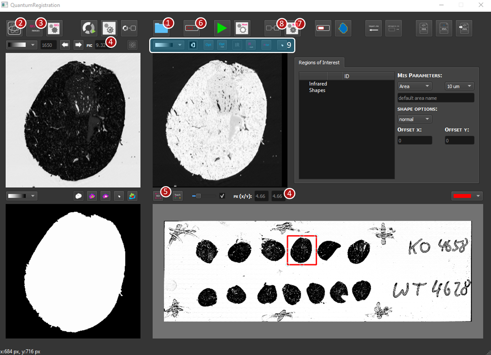
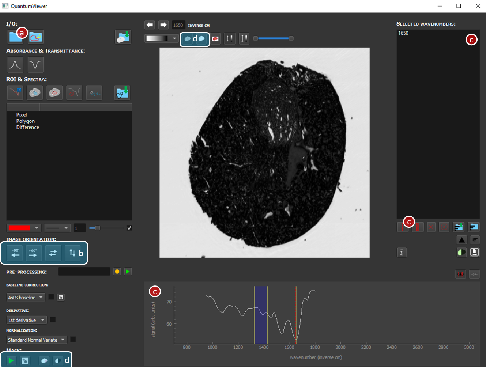
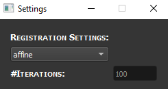
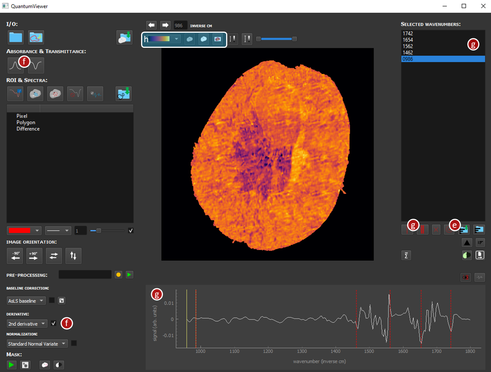
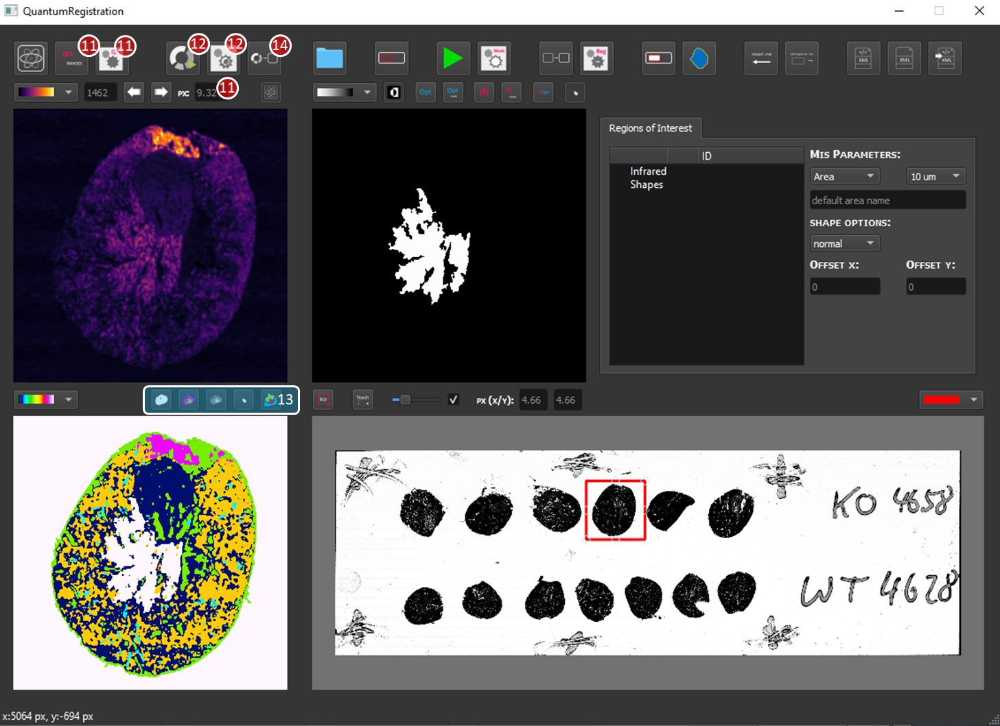
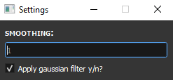
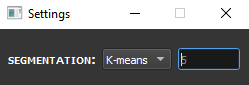
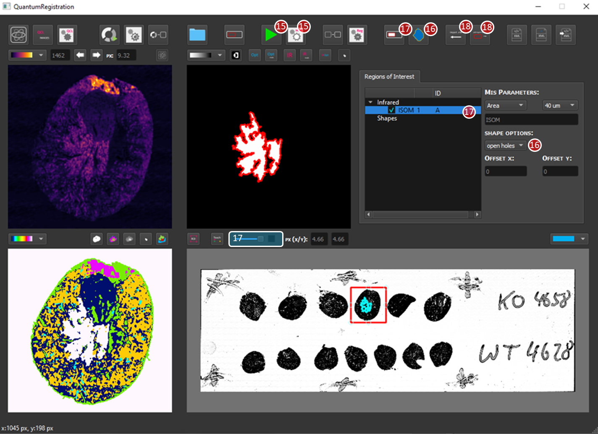
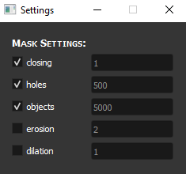
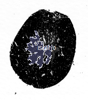

# Quantum Cascade Laser (QCL) Mid-Infrared Imaging (MIR)-guided MALDI Mass Spectrometry Imaging (MSI)

The purpose of this application is to provide a tool for the proposed QCL-MIR-guided MSI workflow. 
It accepts mid-infrared imaging data as an input, performs image registration and segmentation to ultimately generate a MALDI MSI data acquisition file (.mis) that can be executed on respective MS instruments. 
The implementation of this application allows the user to process their data according to their specific needs (i.e. their biological questions) and thereby facilitates region specific in-depth MSI analysis.

## Basic Instructions

### 1. Overview and Installation

An executable version of the software is available that runs on Windows.

The software needs a working Python 3 environment including various Python packages. An overview of the packages and their used versions is given in the *requirements.txt* document. If you're using a later version, you might need to make a few small changes to the code to get it running.

- Operating system: Windows 10 Education
- Processor: Intel(R) Core(TM) i5-9600K CPU @ 3.70GHz   3.70 GHz
- RAM: 32GB
- Python Interpreter: Python v3.8 
- Distribution: Anaconda3 (https://www.anaconda.com/download)
- Python IDE: PyCharm (https://www.jetbrains.com/de-de/pycharm/)
- Platform GUI: PyQt5 (https://pypi.org/project/PyQt5/)

Note: please choose any other Python integrated development environment (IDE)

### 2. Data
We provide a [test data set](https://figshare.com/s/6af0358f6b691eb9caaa) that consists of 
- an empty (no measurement regions included) .mis file,
- a single wavenumber image used as a reference (non-teached image file for simplicity)
- a hyperspectral test data set of a kidney section (size was reduced 2x for simplicity).
Accordingly, the respective pixels sizes are: 4.66 µm for the refrence image and 9.32 µm for the hyperspectral dataset.

A link to full data sets are provided in the corresponding publication.

### 3. Bug reporting:

Feedback of any kind, including questions and bug reports, should be directed to the relevant author(s).

### 4. Instructions:
Here, we provide a brief demo with the aim to give a rough overview of the main functionality of the GUI.

In order to run the GUI, run *M2iraQuantReg.py*. If you wish to only visualise MIR data and perform basic pre-processing steps, please run *M2iraQuantView.py*, which accepts *.zarr, *.fsm and *.pickle files in the current implementation. 

#### Image Registration:
1)	Open a single wavenumber reference image (.tiff file), may take a while.
2)	Open QuantumViewer – process with the following steps
- a)	Import hyperspectral data as .pickle file. **Select both .pickle files simultaneously**.
- b)	Optionally: modify image orientation. Here: rotate image by 90°.
- c)	Select single wavenumber and add it to the list.
- d) 	Optionally: modify image mask.
3)	Obtain selected IR data and image mask (from the list in QuantumViewer).
4)	Specify pixel size. After entering the input value in each field press enter to accepted new value, input turns light-grey.
5)	Obtain image subset. Therefore press (5) and move the red square to the tissue section of interest (same as hyperspectral data) and
6)	press button (6), may take a while.
7)	Select segmentations parameters: here affine and 100 iterations.
8)	Register images.
9)	Visualize registration results.

#### Image Segmentation:
As an example, we want to segment the ISOM region of the kidney.

10)	Perform feature or spectral band selection of IR data incl. pre-processing options.
    - e)	Delete single wavenumber from list.
    - f)	Perform image processing. Here 2nd derivative of absorbance.
    - g)	Select spectral features or bands. 
    - h)	Change between different visualizations.
11)	Obtain features or spectral bands of IR data. Optionally select smoothing via a Gaussian filter. Make sure the correct pixel size is set.
12)	Perform image segmentation. Here: k-means clustering (k=5) on masked image. 
13)	Visualize  segmentation results and select ROI (left or right click on segments).
14)	Transfer segments into the frame of the single wavenumber image.

#### Generate ROI and measurement region:
15)	Modify ROI, e.g. remove small objects or small holes.
16)	Generate shape (e.g. normal or open holes)
17)	Visualize shape on single wavenumber image. The ROI will appear in the “Infrared” list.
18)	Include ROI into .mis-file. Select raster size (here 40µm) and type (Measurement area or ROI). Select Name.

